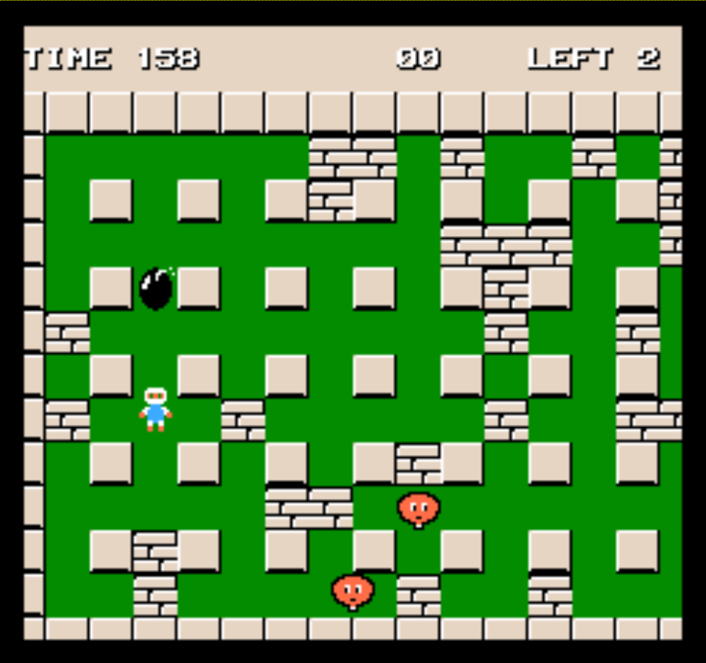

# Overview of Bomber Man

This is a very simple, keyboard-operated game. The main content is to control the player, release bombs, and destroy some wandering enemies. The player needs to be careful not to come into contact with enemies and not be bombed by his bombs. When all the enemies are destroyed by bombs, the player wins.

The entire game map is static; players and enemies will move up, down, left, and right on the map. The entire game map is divided into squares of the same size, and bombs are only allowed to be placed in one square and are not allowed to be placed at the junction of two squares.

Therefore, depending on the nature of the game content, the entire game can be divided into the following parts:

- static map background
- game status bar (which needs to be displayed on the page at all times)
- players, enemies, bombs, destructible walls, indestructible walls, pass exits

I plan to make a 3D game background map model in my project because it is static. It just simply translates to left or right with the player's position. And its content is fixed on the green floor. All sides of the map and the walls on the map separated by a square are indestructible. Therefore, I will use Blender to make a 3D game map model or C++ encapsulate a class specially used to draw the map background.

The game status bar is very simple, it just needs to record the game time, score, and several games left. These can be used as some variables that can be controlled in the program using C++ to display in the corresponding position.

For players, enemies and bombs, Blender can be used to create 3D model objects and import the corresponding models directly into the game program, then use the program to manipulate the position of these models. The Player's position can be bound to keyboard events, through the keyboard to control the player's movement. Bombs are based on the player's release position, choose the nearest square centre to place the bombs. Enemy's movement may need to follow some algorithms to make the game more interesting, for example, when the distance with the player into a certain range can automatically track the player, when the distance with the player is too far away, then randomly move. Destroyable walls are expected to use Blender to create the corresponding models, imported into the program and arranged by the pre-arranged placement coordinates.

The 3D models of the player, enemies and bombs can be projected differently depending on the angle of the light source, or can be mirrored by reflecting the light source. The game can be viewed in two modes, one overlooking the entire game map and one with the player in first person.

If conditions permit, I would want to add some props and sounds to the basic gameplay flow to add interest to the game. For instance, props that can enhance player skills appear after blowing up walls and enemies (increase bomb blast range, player movement speed, player invincibility time, etc.)

