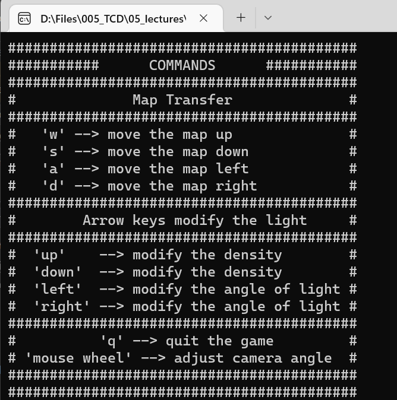
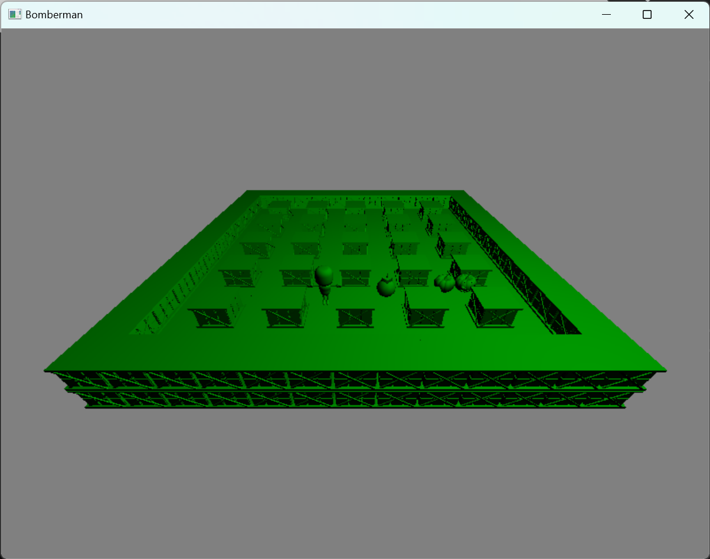
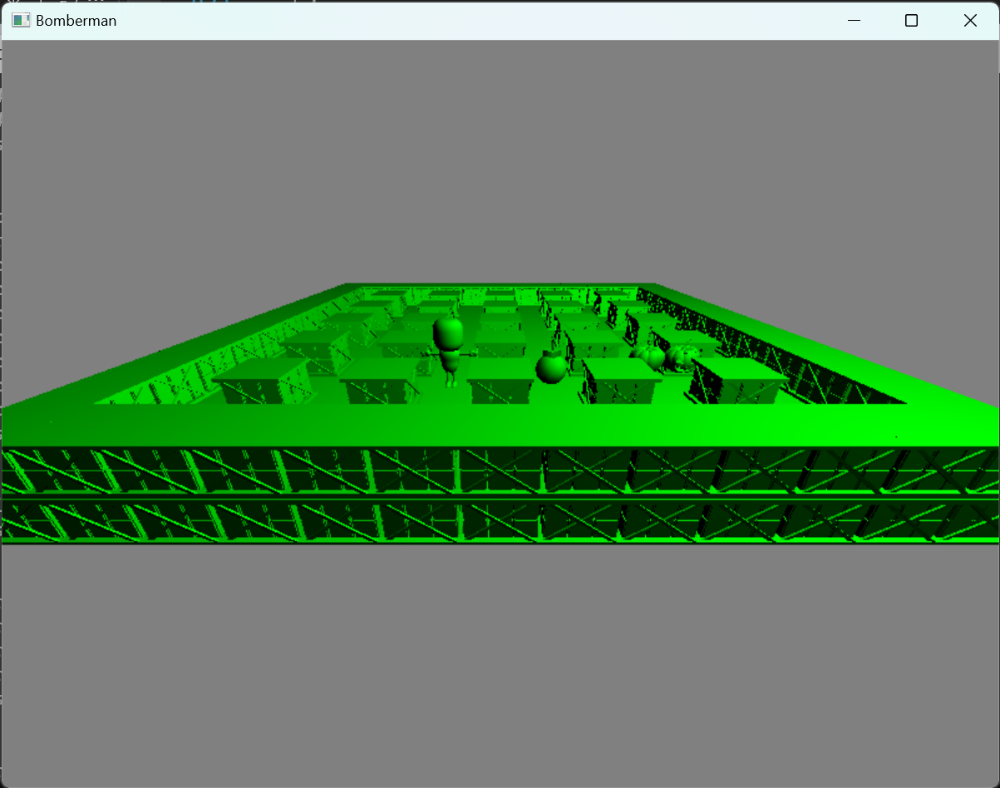

# Bomberman

The game code is developed based on Lab4's code.

When running the bomberman game, the instructions will be displayed in the console. It can be seen that there are some mouse and keyboard events in this game. You can use "w", "s", "a" and "d" to move the map. And use the arrow keys to modify the attributes of light, such as the density and the angle. The mouse wheel can adjust the angle of camera.

> 
>
> 
 Instructions displayed in the console.

> 
>
> 
 Initial scene of game

> 
>
> 
The scene after adjusting the camera angle of view and lighting properties

