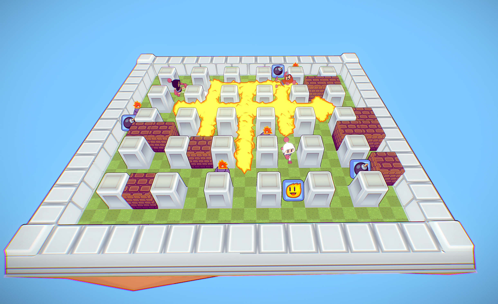
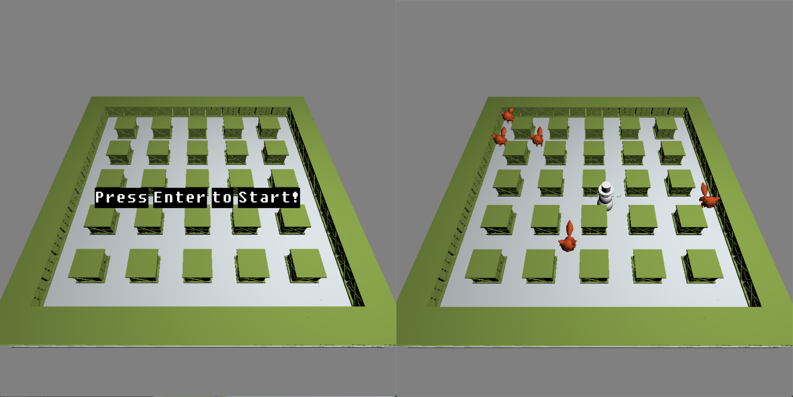

# Bomberman

## Introduction

This is a very simple, keyboard-operated game. The main content is to control the player, release bombs, and destroy some wandering enemies. The player needs to be careful not to come into contact with enemies and not be bombed by his bombs. When all the enemies are destroyed by bombs, the player wins. 

The entire game map is static; players and enemies will move up, down, left, and right on the map. The entire game map is divided into squares of the same size, and bombs are only allowed to be placed in one square and are not allowed to be placed at the junction of two squares. Therefore, depending on the nature of the game content, the entire game can be divided into the following parts:

- static map background
- players
- enemies
- bombs
- indestructible walls

> 
>
> <p align='center'>Sourced from sketchfab(This is how I want it to be)</p>
>
> Source: [Newsfeed - Sketchfab](https://sketchfab.com/3d-models/bomberman-battle-05bd42edebcf46d896ebdd26b4d77cda)

## Implementation

This project mainly uses C++ to develop based on the OpenGL framework. In addition, some libraries are used to assist in the development: 

- glew 
- freeglut
- glm
- assimp
- gltext

Among them, `glew` and `freeglut` are mainly used for building windows, etc. related to openGL operate. `glm` is a mathematical library, this project is used for matrix operations. `Assimp` is used to import 3D models and materials. `gltext` is a library for rendering text developed based on native OpenGL, which is used to render text that needs to appear in games.

> 
>
> <p align='center'>The final look of this project</p>

### Code Explanation

The code of this project is based on the Lab4 code in the experimental class.

### Main

The beginning of the project is the result of a series of functions of `freeglut`. The size of the game window is defined as a constant, which is 1000*1000. After the window is created using the `freeglut` function, the window is displayed in the center of the screen by obtaining the resolution of the current screen.

Then various functions are bound to the project, the display function for cyclic rendering and display, and the reshape function for automatic adjustment when the window changes. Since the game requires the participation of the keyboard and mouse, related mouse and keyboard events are also activated here.

```C++
GLint WIDTH = 1000; // window width 
GLint HEIGHT = 1000; // window height

int main(int argc, char** argv) {
	srand(time(NULL)); // Initialize the random number generator

	instructions();
	// Creating model initial values
	// Model 1 View
	scene.projection = perspective(80, (float)(WIDTH) / (float)HEIGHT, 0.1, 100.0);
	scene.view = identity_mat4();
	scene.model = identity_mat4();
	scene.ortho = identity_mat4();

	// Set up the window
	glutInit(&argc, argv);
	glutInitDisplayMode(GLUT_DOUBLE | GLUT_RGB);

	// Get screen resolution
	int screen_width = GetSystemMetrics(SM_CXSCREEN);
	int screen_height = GetSystemMetrics(SM_CYSCREEN);
	// Set the size and position of the window
	glutInitWindowSize(WIDTH, HEIGHT);
	glutInitWindowPosition((screen_width - WIDTH) / 2, (screen_height - HEIGHT) / 2 - 50);
	glutCreateWindow("Bomberman");

	// Tell glut where the display function is
	glutDisplayFunc(display);
	glutReshapeFunc(reshape);
	glutIdleFunc(updateScene);
	glutKeyboardFunc(keyPress);
	glutSpecialFunc(specialKeypress);
	glutPassiveMotionFunc(mouseMove);
	glutMouseWheelFunc(mouseWheel);

	// A call to glewInit() must be done after glut is initialized!
	GLenum res = glewInit();
	// Check for any errors
	if (res != GLEW_OK) {
		fprintf(stderr, "Error: '%s'\n", glewGetErrorString(res));
		return 1;
	}
	// Set up your objects and shaders
	init();
	// Begin infinite event loop
	glutMainLoop();
	return 0;
}
```
### Init

```C++
void init()
{
	srand((unsigned)time(0));

	gltViewport(WIDTH, HEIGHT);

	// Set up the shaders
	GLuint shaderProgramID = CompileShaders();
	cube = load_mesh("Cargo.dae"); // box
	bomb = load_mesh("bomb.dae"); // box
	enemy = load_mesh("cat.dae"); // box
	bomberman = load_mesh("snowman.dae"); // box


	glGenVertexArrays(1, &cube_vao);
	generateObjectBufferMesh(cube, cube_vao, cube_vp_vbo, cube_vn_vbo);

	glGenVertexArrays(1, &bomb_vao);
	generateObjectBufferMesh(bomb, bomb_vao, bomb_vp_vbo, bomb_vn_vbo);

	glGenVertexArrays(1, &enemy_vao);
	generateObjectBufferMesh(enemy, enemy_vao, enemy_vp_vbo, enemy_vn_vbo);

	glGenVertexArrays(1, &bomberman_vao);
	generateObjectBufferMesh(bomberman, bomberman_vao, bomberman_vp_vbo, bomberman_vn_vbo);
}
```

The `init` function mainly performs some initialization operations on the project, such as initializing random numbers, importing the required models, and binding these models to the corresponding `vao` and `vbo`. In this way, when the project needs it, I can directly call `glDrawArrays` to draw them. These 3D dae format models are all from this website: https://www.turbosquid.com/. Use `assimp` to read the model file, forcing it to be read as triangles. Then pass the color value to the shader through the uniform variable defined in the display, and perform different color assignment operations on different meshes.

Here, a function `generateObjectBufferMesh` is used to create the buffer corresponding to the model, which is bound to `VAO` and  `VBO`. In addition, this function can also import the material corresponding to the model, but I have not tried it successfully. It seems to be a problem with the format and encoding of the material. Therefore, the models of this project are all without materials, and are all displayed in different colors through lighting effects.

```C++
void generateObjectBufferMesh(ModelData mesh_data, GLuint vao, GLuint vp_vbo, GLuint vn_vbo) {
	/*----------------------------------------------------------------------------
	LOAD MESH HERE AND COPY INTO BUFFERS
	----------------------------------------------------------------------------*/
	GLuint loc1, loc2, loc3;
	loc1 = glGetAttribLocation(shaderProgramID, "vertex_position");
	loc2 = glGetAttribLocation(shaderProgramID, "vertex_normal");
	loc3 = glGetAttribLocation(shaderProgramID, "vertex_texture");

	glGenBuffers(1, &vp_vbo);
	glBindBuffer(GL_ARRAY_BUFFER, vp_vbo);
	glBufferData(GL_ARRAY_BUFFER, mesh_data.mPointCount * sizeof(vec3), &mesh_data.mVertices[0], GL_STATIC_DRAW);
	glGenBuffers(1, &vn_vbo);
	glBindBuffer(GL_ARRAY_BUFFER, vn_vbo);
	glBufferData(GL_ARRAY_BUFFER, mesh_data.mPointCount * sizeof(vec3), &mesh_data.mNormals[0], GL_STATIC_DRAW);

	//	unsigned int vt_vbo = 0;
	//	glGenBuffers (1, &vt_vbo);
	//	glBindBuffer (GL_ARRAY_BUFFER, vt_vbo);
	//	glBufferData (GL_ARRAY_BUFFER, monkey_head_data.mTextureCoords * sizeof (vec2), &monkey_head_data.mTextureCoords[0], GL_STATIC_DRAW);

	glBindVertexArray(vao);
	glEnableVertexAttribArray(loc1);
	glBindBuffer(GL_ARRAY_BUFFER, vp_vbo);
	glVertexAttribPointer(loc1, 3, GL_FLOAT, GL_FALSE, 0, NULL);
	glEnableVertexAttribArray(loc2);
	glBindBuffer(GL_ARRAY_BUFFER, vn_vbo);
	glVertexAttribPointer(loc2, 3, GL_FLOAT, GL_FALSE, 0, NULL);

	//	glEnableVertexAttribArray (loc3);
	//	glBindBuffer (GL_ARRAY_BUFFER, vt_vbo);
	//	glVertexAttribPointer (loc3, 2, GL_FLOAT, GL_FALSE, 0, NULL);
}
```

### Display

The Display function mainly renders the game page. Since this function is called continuously, it is necessary to properly judge when to render what graphics and when to display what it looks like, all of which are set here.

So at the beginning, define some viewing angle matrix variables through functions that can link `shader` to control the camera angle of the screen. Then also based on this, define the uniform variables that control the position and intensity of the light source.

When some basic conditions of the game are ready, the operations related to the game can be prepared. For example, draw the canvas of the game, judge the start state of the game to judge whether to draw enemies and players.

```c++
void display() {

	// tell GL to only draw onto a pixel if the shape is closer to the viewer
	glEnable(GL_DEPTH_TEST); // enable depth-testing
	glDepthFunc(GL_LESS); // depth-testing interprets a smaller value as "closer"
	glClearColor(0.5f, 0.5f, 0.5f, 1.0f);
	glClear(GL_COLOR_BUFFER_BIT | GL_DEPTH_BUFFER_BIT);

	glUseProgram(shaderProgramID);
	// Declare your uniform variables that will be used in your shader
	model_location = glGetUniformLocation(shaderProgramID, "model");
	view_mat_location = glGetUniformLocation(shaderProgramID, "view");
	proj_mat_location = glGetUniformLocation(shaderProgramID, "proj");
	ortho_mat_location = glGetUniformLocation(shaderProgramID, "ortho");

	float lightX, lightZ;
	lightX = Light_rad * cos((Light_angle / 180) * PI);
	lightZ = Light_rad * sin((Light_angle / 180) * PI);
	int vertexColorLocation = glGetUniformLocation(shaderProgramID, "LightPosition");
	glUniform4f(vertexColorLocation, lightX, LightPosition.v[1], lightZ, LightPosition.v[3]);

	float tempLd = ld;
	int Ld_ = glGetUniformLocation(shaderProgramID, "Ld");
	glUniform3f(Ld_, tempLd, tempLd, tempLd);

	// Game function
	int model_color = glGetUniformLocation(shaderProgramID, "color");
	draw_map(model_color);

	if (isGameStart) {
		draw_bomb(model_color);

		draw_bomberman(model_color);

		draw_enemy(model_color);
	} else if (!isGameFinished) {
		drawText("Press Enter to Start!", 3);
	}

	glutSwapBuffers();
}
```

Among them, every time the model is rendered, it is necessary to set the position, size, rotation, etc. of the model. These settings are all done in a function called `draw_model()`. The model can be set by passing in the corresponding model and the size to be scaled, the position of translation and the angle of rotation. All models are rendered in-game in this way. It should be noted that the order of adjustment here is strict, that is, first rotate, then scale, and finally translate. Otherwise there will be problems.

The specific code is as follows：

```c++
void draw_model(ModelData mesh, float scale_num = 1., vec3 trans=vec3(0.,0.,0.), float rotate_x = 0., float rotate_y = 0., float rotate_z = 0.) {
	// Main Viewport
	//glViewport(0, 0, WIDTH, HEIGHT);

	mat4 temp = identity_mat4() * scene.model;
	temp = rotate_z_deg(temp, rotate_z);
	temp = rotate_y_deg(temp, rotate_y);
	temp = rotate_x_deg(temp, rotate_x);
	temp = scale(temp, vec3(.1f, .1f, .1f) * scale_num);
	temp = translate(temp, trans);

	glUniformMatrix4fv(proj_mat_location, 1, GL_FALSE, scene.projection.m);
	glUniformMatrix4fv(view_mat_location, 1, GL_FALSE, scene.view.m);
	glUniformMatrix4fv(model_location, 1, GL_FALSE, temp.m);
	glUniformMatrix4fv(ortho_mat_location, 1, GL_FALSE, scene.ortho.m);
	glDrawArrays(GL_TRIANGLES, 0, mesh.mPointCount);
}
```

Since the functions for creating these models are similar, they will not be shown in the report. If necessary, you can see the source code. Some important functions are shown below:

### Randomize enemy positions

In order to increase the fun and experience of the game, the initial position of the enemy is hereby randomized. Use the random function of C++ to randomize the enemy's position. Then by avoiding where the blocks are, it can create enemies in different positions each time you start the game.

```C++
std::vector<vec3> rand_enemy_pos() {
	std::vector<vec3> positions;
	for (int i = 0; i < 5; i++) {
		int x, z;
		do {
			x = rand() % 21 - 10;
			z = rand() % 21 - 10;
		} while (x == 0 || z == 0 || x % 4 == 0 || z % 4 == 0 || x % 2 != 0 || z % 2 != 0);
		positions.push_back(vec3(x, 2, z));
	}
	return positions;
}
```

### Collision Detection

There are many places in the game that require collision detection, such as bombs destroying enemies, bombs and players, etc., all of which require collision detection. Therefore, a function is encapsulated here, by judging the x and z coordinates between the two, and then calculating the distance between them, if it is less than the set value, it is considered a collision.

```C++
bool checkCollision(int x1, int z1, int x2, int z2, int len) {
	if (abs(x1 - x2) < len && abs(z1 - z2) < len) {
		return true;
	}
	else {
		return false;
	}
}
```

### Bomb explosion

The effect of the bomb explosion uses some tricks. When the bomb is placed, the placement time is calculated, and then the difference between the current time and the placement time is calculated. When the interpolation is greater than 3 seconds, the bomb explodes. In addition, through the current time, some animation processing is done on the bomb that is about to explode, such as setting the angle of rotation around y, and changing the size of the bomb. When the size is greater than 3, it will be converted into a different color.

```C++
void fire() {
	DWORD curr_time = timeGetTime();
	if (curr_time - lastSpacePressTime >= 3000) {
		int dx[] = { 1, 2, -1, -2, 0, 0, 0, 0 };
		int dz[] = { 0, 0, 0, 0, 1, 2, -1, -2 };

		for (int i = 0; i < 8; i++) {
			int x = BombPosX + dx[i];
			int z = BombPosZ + dz[i];

			draw_model(bomb, 20, vec3(x, 2, z));
			checkEnemy(x, z);
		}
	}
}

void draw_bomb(int model_color) {
	if (isShowBomb) {
		glBindVertexArray(bomb_vao);
		glUniform3f(model_color, 143.0 / 255.0f, 95.0 / 255.0f, 170.0 / 255.0f);

		DWORD curr_time = timeGetTime();
		float y = curr_time % 360;
		float size = curr_time % 5;

		if (size > 3) {
			glUniform3f(model_color, 255.0 / 255.0f, 139.0 / 255.0f, 46.0 / 255.0f);
		}
		draw_model(bomb, 20 + size, vec3(BombPosX, 2, BombPosZ), 0, y);

		glUniform3f(model_color, 255.0 / 255.0f, 139.0 / 255.0f, 46.0 / 255.0f);
		fire();
	}
}
```

Finally, the following code fragment is set in the `updateScene` function to clear the bomb after the bomb explodes:

```C++
	if (curr_time - lastSpacePressTime >= 3500) {
		isShowBomb = false;
		lastSpacePressTime = 0;
	}
```

### Enemy Movement

:star: This part of the code is not completed when the video is recorded.

In order to increase the fun, let the enemy move randomly, and cannot move beyond the boundary when moving. Edges change direction when the boundary is exceeded.

```C++
// enemy
int direction[5] = { -1, 1, 1, 1, -1 }; // Movement direction, 1 means right or up, -1 means left or down
int directionX[5] = { 1, 0, 1, 1, 0 };
int directionZ[5] = { 0, 1, 0, 0, 1 };
float speed = 0.1; // Movement speed

void enemy_move(int i) {
	enemy_pos[i].v[0] += direction[i] * speed * directionX[i];
	enemy_pos[i].v[2] += direction[i] * speed * directionZ[i];
	//Judging whether the boundary is exceeded
	if (enemy_pos[i].v[0] > 10 || enemy_pos[i].v[0] < -10) {
		direction[i] = -direction[i]; // change direction
	}
	if (enemy_pos[i].v[2] > 10 || enemy_pos[i].v[2] < -10) {
		direction[i] = -direction[i]; // change direction
	}
}

void draw_enemy(int model_color) {
	if (enemy_pos.size() && isGameStart) {
		glBindVertexArray(enemy_vao);
		glUniform3f(model_color, 215.0 / 255.0f, 85.0 / 255.0, 40.0 / 255.0f);
		for (int i = 0; i < enemy_pos.size(); i++) {
			enemy_move(i);
			draw_model(enemy, 40, enemy_pos[i]);
		}
	} else if (isGameStart && enemy_pos.size() == 0) {
		isGameFinished = true;
		drawText("YOU WIN!!!", 3);
	}
}
```

### Change View model

The switching of perspective is very simple in this project. By directly changing the starting coordinates of the camera, different viewing angles can be changed. Operations including map rotation, viewing angle transformation, and initializing the viewing angle are the results of modifying the initial coordinates of the camera. This code is written in `updateScene` function:

```C++
	if (isRotate) {
		// Rotate the model slowly around the y axis at 20 degrees per second
		rotate_y += 20.0f * delta;
		rotate_y = fmodf(rotate_y, 360.0f);
	}
	int camera_len = sqrt(camera_x * camera_x + camera_z * camera_z);
	scene.view = look_at(vec3(camera_len * cos(glm::radians(rotate_y)), camera_y, camera_len * sin(glm::radians(rotate_y))), vec3(0.0f, 0.0f, 0.0f), vec3(0, 1, 0));
	scene.model = identity_mat4();
```

## Conclusion

I have learned a lot about the actual combat of this project. However, due to time and energy, I spent a lot of time on trial and error. For example, I tried many methods but failed to load the material successfully. In addition, models in other formats cannot be easily imported. There is still some distance from my ideal state, but I believe that I will gain something in my future studies.