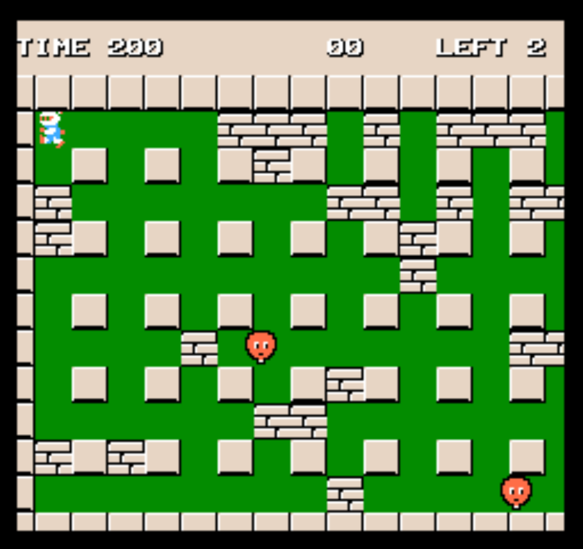
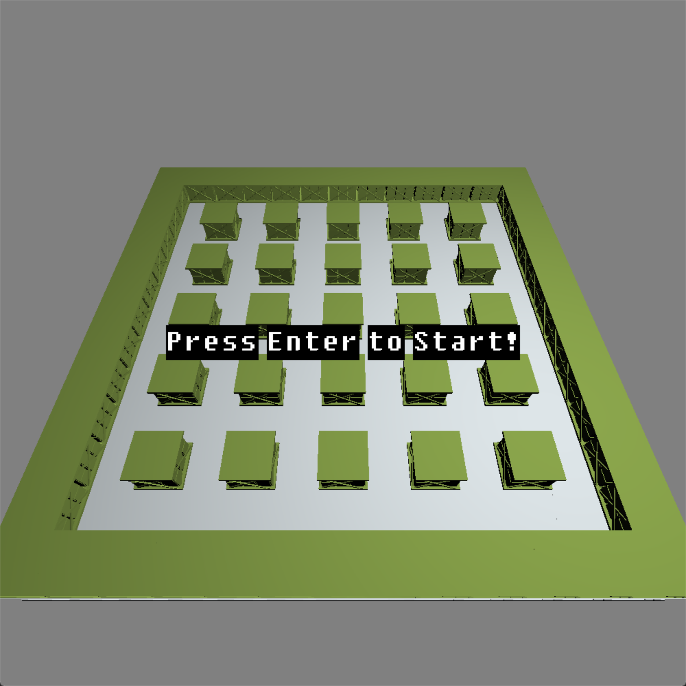
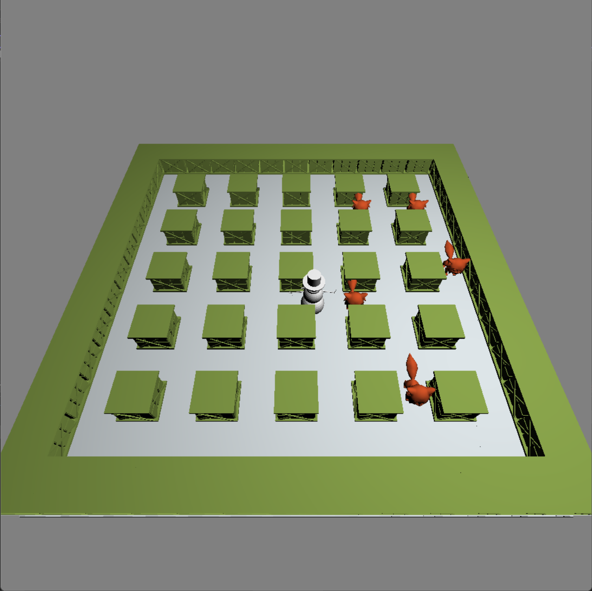

# CG-Final-Assignment

## Description

This is a final assignment of Computer Graphics module for Computer Science Master in Virtual Reality and Augmented Reality Strand at Trinity College Dublin (TCD). The goal of the project is to create a 3D OpenGL version of one of the classic Arcade games here: https://www.free80sarcade.com/topgames.php. And I chose [`Bomber Man`](https://www.free80sarcade.com/nes_Bomberman.php) as my final assignment.

## Compulsory OpenGL elements

:star:  you can use your lab exercises to develop these

1. Display at least one 3D polygon mesh - you may generate this or load scene/objects from a file;
2. Allow interactive manipulation of part of the 3D scene (i.e. transforms) using keyboard/mouse or some other device;
3. Include at least one complex object with a hierarchical structure undergoing transformations;
4. The scene must be lit and shaded; including diffuse and specular objects;
5. Support at least two different camera views, e.g.,
   - first person view with camera movements allowing user to walk or fly through the scene; 
   - top down view (e.g. overhead map)

## Demo

- Bilibili: [OpenGL-3D-Bomberman_哔哩哔哩_bilibili](https://www.bilibili.com/video/BV1SA411Z7dB/?vd_source=6f1f06fb53ab8c01a431f82f4cec8897)
- YouTube: [CS7GV6_2022_ Pan_Long_Bomberman - YouTube](https://www.youtube.com/watch?v=NQjxSkcH_8Y&t=48s&ab_channel=LongPan)

## Dependencies

The project requires these libraries: `GLEW`, `FREEGLUT`, `ASSIMP`, `GLM`.

## Screenshots

